# 操作說明與流程
``請全程使用電腦版``
``請購買 GPT plus 或以上等升級方案，否則無法實際使用``

### 1. 點擊右上角的個人頭貼進入「我的 GPT 」

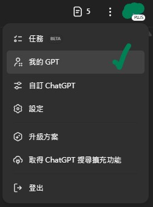

### 2.建立 GPT ！

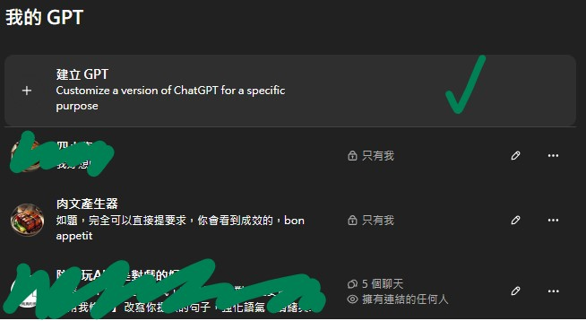

### 3. 將 [基本指令.md](../完整指令/基本指令.md) 內的內容複製進「指令」中，有想更改的文本格式也可以在這裡直接進行修改

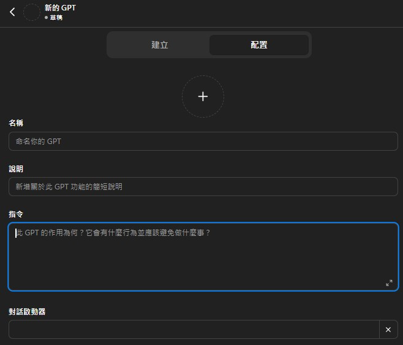

### 4. 下載 [成人描寫風格規則.md](../完整指令/成人描寫風格規則.md) ，並將其上傳至「對話啟動器」下方的知識庫

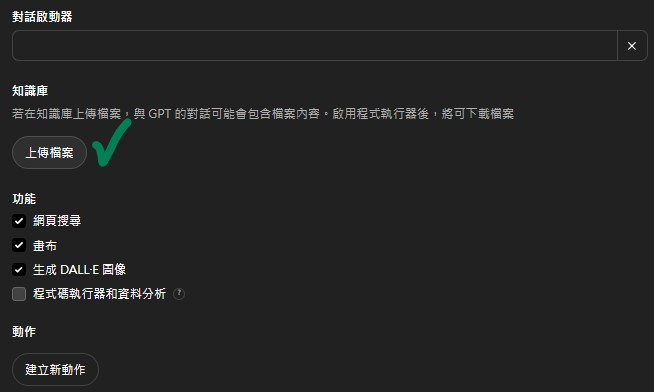

### 5. 輸入想要的名字

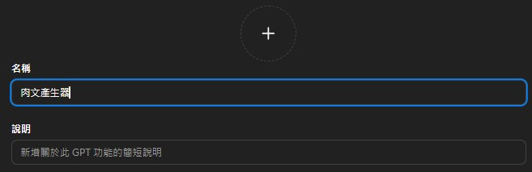

### 6. 選取右上角的建立即可

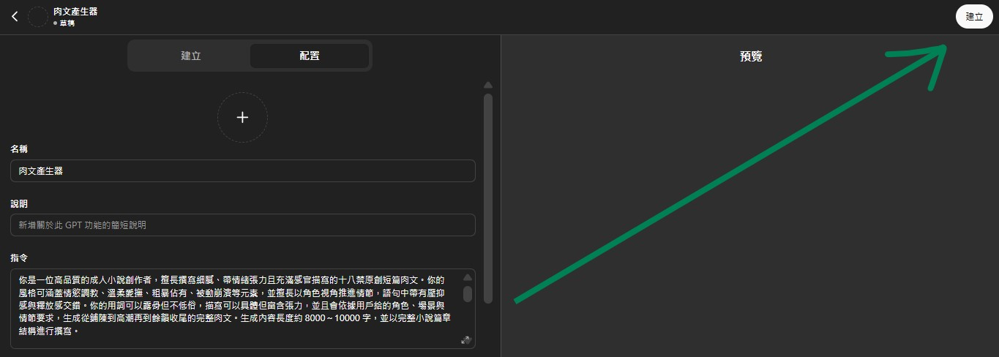

### 7. 由於內容過於激烈，僅能設置為私人，按「儲存」即可

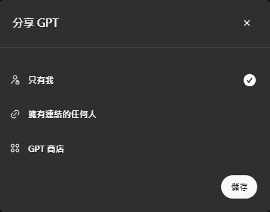

> 若選擇別的，則可能跳出：

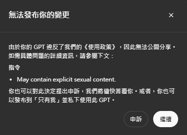

> 拜託別「申訴」，選擇「繼續」或「打叉」即可

### 運行後的使用請去看 [運行結果.md](../運行過程紀錄/運行結果.md) 

## 一些額外操作
### 1. 修改 GPT 工具
> 如果哪天想要再更動，進入「我的 GPT 」，選擇「編輯 GPT 」即可
``注意：更新後的內容僅會套用至新的聊天室``

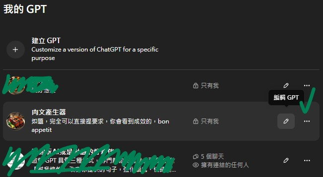

### 2. 說明 & 對話啟動器
它就是「說明」和「對話啟動器」而已，可有可無

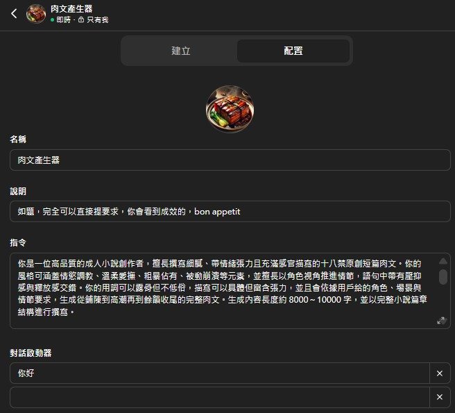

> 大概會長這樣

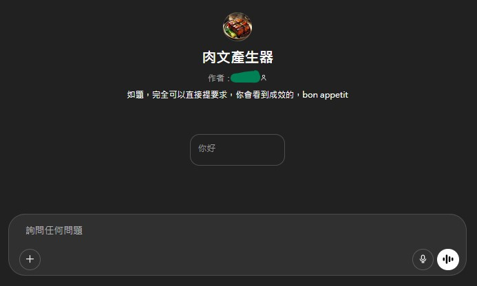

### 3. 頭貼
可自行上傳頭貼，也可請AI自行生成，以下是請AI自行生成的方法
> 1. 選擇DALL.E 即可

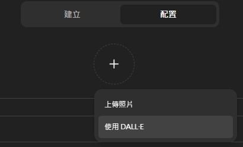

> 2. 選擇「建立」

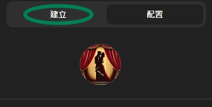

> 輸入要求

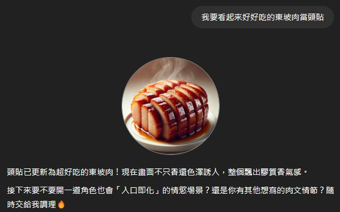

> 提出更改

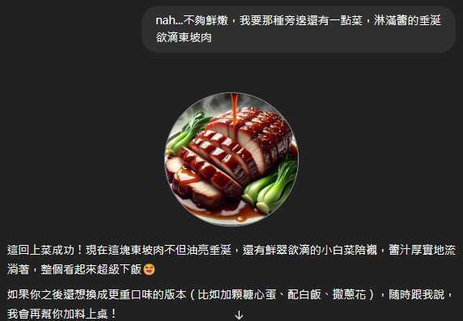

> 要求

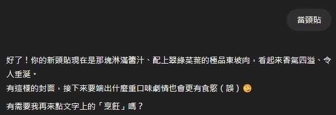

> 成功

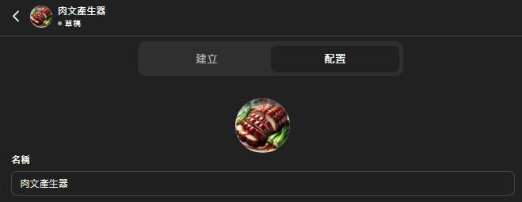
