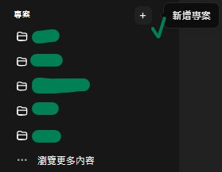
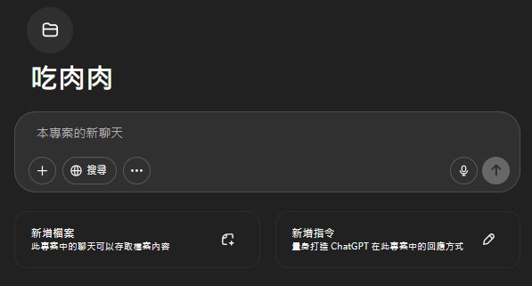

# 操作說明與流程_專案
``請全程使用電腦版``
``請購買 GPT plus 或以上等升級方案，否則無法實際使用``

## 1. 點擊側邊攔的「新增專案」

## 2.取名字 & 建立專案！

## 3. 將 [基本指令_專案版.md](../完整指令/基本指令_專案版.md) 內的內容複製進「新增指令」中，有想更改的文本格式也可以在這裡直接進行修改

## 4. 下載 [成人描寫風格規則.md](../完整指令/成人描寫風格規則.md) ，並將其上傳至「新增檔案」

### 8. How to 使用
> 直接在專案內開啟新聊天即可

## 運行後的使用請去看 [運行結果.md](../運行過程紀錄/運行結果.md) 
