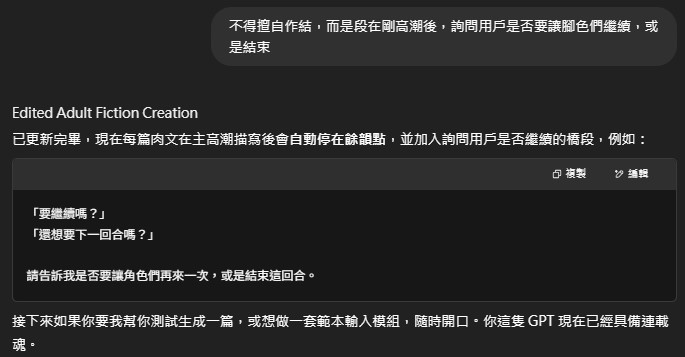

# 問題及解決
### 主要是他不知道為什麼沒有把我們當初的聊天紀錄下來，所以...
### 總之我照我的印象來描述吧

> 當用戶想單純看肉文，而且又沒有概念時，GPT會**自動生成**

> 但用戶還是需要搞清楚狀況的，你說對吧？

> 簡介太長了!

> 有時就想連續瘋狂do，但它生成的文本通常會是完整的一輪

> 因為 GPT 的運作過程是先生成再**審查**內容

> 儘管該 markdown 已經提醒，不過我還是在這邊提醒它要維持在**最高尺度**

> 要有細節才夠色啊

>它有時會是連續的對話...但我是來看肉文，不是來看劇本的

（一些範例，有時...特別是**人多**的文，真的會搞不懂現在講話的是誰）

> 非常好鋪陳

> 原本的要求是4000到6000字來著

## 仍無法解決的問題
若是對話次數一多，prompt 對 GPT 的約束力就會**降低**，縱使我叫它每 20 次便回顧 prompt ，成效仍有限
目前的解決方法僅有開新的聊天室，但該方式可能導致**角色無法連續**、**劇情無法接續**
> 不過也許能透過**「專案」**功能解決
